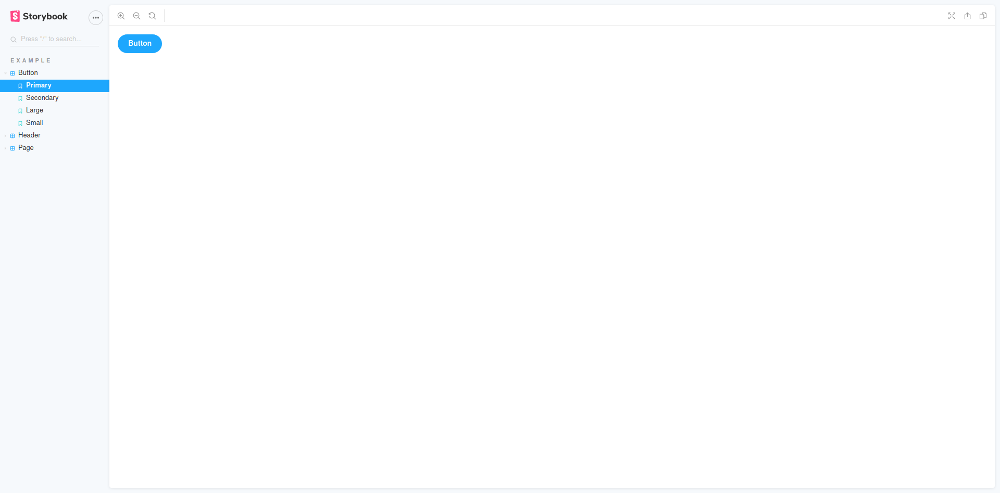

# Storybook6 building with Errors with Yarn 2 monorepo + React + Typescript

This is a monorepo using Yarn Berry (Yarn 2).
It contains 1 package called "frontend".

The package has basic typescript configuration to build the lib/_ to dist/_

The lib/ exports a React component

The storybook was configured by running `yarn dlx sb init`

`core-js` dependency was then added because it's missing in dev dependencies (solution inspired from [#11255](https://github.com/storybookjs/storybook/issues/11255))

runing the command `yarn workspace frontend storybook` initially throws the following error:

```
info @storybook/react v6.0.26
info
info => Loading presets
WARN   Failed to load preset: {"name":"@storybook/addon-essentials","type":"presets"} on level 1
ERR! Error: @storybook/core tried to access @storybook/addon-essentials, but it isn't declared in its dependencies; this makes the require call ambiguous and unsound.
ERR!
ERR! Required package: @storybook/addon-essentials (via "@storybook/addon-essentials")

.... more skipped lines ....

info => Loading config/preview file in "./.storybook".
info => Loading config/preview file in "./.storybook".
info => Adding stories defined in ".storybook/main.js".
info => Using default Webpack setup.
webpack built 3e6c15753da82e4fb54b in 8571ms
⚠ ｢wdm｣: Hash: 3e6c15753da82e4fb54b
Version: webpack 4.44.2
Time: 8571ms

.... more skipped lines ....

WARNING in ./stories/Introduction.stories.mdx 11:0
Module parse failed: Unexpected token (11:0)
You may need an appropriate loader to handle this file type, currently no loaders are configured to process this file. See https://webpack.js.org/concepts#loaders
| import StackAlt from './assets/stackalt.svg';
|
> <Meta title="Example/Introduction" />
|
| <style>{`
 @ \.)(?=.)[^/]*?\.stories\.mdx)$ (./stories sync ^\.(?:(?:^|\/|(?:(?:(?!(?:^|\/)\.).)*?)\/)(?!\.)(?=.)[^/]*?\.stories\.mdx)$) ./Introduction.stories.mdx
 @ ./.storybook/generated-stories-entry.js

.... more skipped lines ....

╭────────────────────────────────────────────╮
│                                                     │
│   Storybook 6.0.26 started                          │
│   9.95 s for manager and 9.45 s for preview         │
│                                                     │
│    Local:            http://localhost:6006/         │
│    On your network:  http://...:6006/               │
│                                                     │
╰────────────────────────────────────────────╯
```

After this step, I'm able to see the basic storybook page with all examples components but all addons seems to be disabled:



## Solutions

### 1/ Upgrade to Storybook v6.1.0-alpha.8 or greater

[related issue](https://github.com/storybookjs/storybook/issues/12805#issuecomment-711153013)

branch: fix/monorepo-compatibility-storybook-6.1

### 2/ [workarround] Enable pnp loose mode

[doc](https://yarnpkg.com/features/pnp#pnp-loose-mode)

branch: fix/monorepo-compatibility-storybook-6.0-pnp-loose

## Dependencies

- "@babel/core": "^7.12.3"
- "@mdx-js/react": "^1.6.18"
- "@storybook/addon-actions": "^6.0.26"
- "@storybook/addon-docs": "^6.0.26"
- "@storybook/addon-essentials": "^6.0.26"
- "@storybook/addon-links": "^6.0.26"
- "@storybook/react": "^6.0.26"

- "babel-loader": "^8.1.0"
- "react-is": "^16.13.1"

- "react": "^16.13.1"
- "react-dom": "^16.13.1"

### Aditionnal Dependencies [#11255](https://github.com/storybookjs/storybook/issues/11255)

- "core-js": "^3.6.5"
